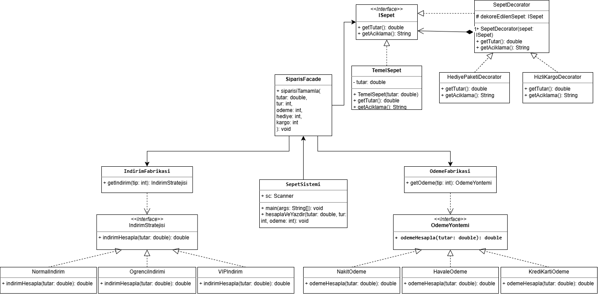

# tasarim-oruntuleri-odev
Java tabanlı E-Ticaret Sepeti tasarım örüntüleri ödevi

Seçilen konu: D: E-Ticaret Sepeti Sebebi: E-Ticaret sepeti farklı indirim senaryoları,farklı ödeme seçenekleri,farklı kullanıcı türleri içermektedir. Bu farklılıklar sayesinde kodu başta karmaşık yazabilir ardından gerekli tasarım örüntülerini kullanarak günlük senaryolarda bu örüntülerin neden gerekli olduğunu gözlemleyebilirim olarak düşündüm.

# Proje ne yapar?
SepetSistemi.java kodlarını çalıştırdığımda:
- Öncelikle sepet hazırlığı aşaması başlar; kullanıcıdan ürünlerin toplam tutar bilgisini girmesi istenir ve arka planda TemelSepet nesnesi oluşturulur.
- Ardından kullanıcı türü ve ödeme seçenekleri istenir. Sistemin bu aşamasinda ise faz1 de kurmuş olduğumuz fabrika sınıfları devreye girmektedir. Bu sınıflar Factory Method'un yanı sıra Strategy'dir; sistemin ilk halinde var olan if-else blokları yerine işlemler bu ayrı sınıflarda gerçekleştirilecektir.
- Bir sonraki aşamada ise sepete yeni özellik (hediye paketi-hızlı kargo) istenip istenmediği sorulur. Bu kısımda ise Decorator pattern görev almaktadır. Yeni nesne oluşturmak yerine mevcut sepet nesnesi üzerine istenilen özellik sarmalanmaktadır.
- Kullanıcının tüm istekleri alınıp, onay aşamasına geldiğinde tüm veriler rastgele değişkenler olarak metotlara gönderilmek yerine Command patterni sayesinde bir görev paketi haline getirilir. Sipariş verme eylemi somut bir nesneye dönüştürülür main sınıfı yalnızca bu nesneyi tetikler. 
- Tetiklenen bu nesne SiparisFacade sınıfını çalıştırır ve paketlenmiş nesnenin son tutarını hesaplar; fabrikalardan gelen indirimleri, ödeme komisyonlarını ekler, eklenmek istenen özelliklerin fiyatlarını uygular. Main sınıfı hepsinden bağımsızdır.
- Tutar bilgisi verildikten sonra Facade sınıfı listesinde ki gözlemcilere sipariş tamamlandığına dair mesaj gönderir. Observer Patterni yeni bildirim sistemlerinin kodun yapısını değiştirmeden eklenmesine olanak sağlar

# Kullanılan örüntü listesi,açıklamaları?
FAZ1
- Factory Method: Bu method ile koddaki devasa if-else bloklarının yapacağı işlemeri, geliştirmeye kapalı her adımda değiştirmeye mecbur bırakan yapıyı farklı sınıflar gelişime açık değişime kapalı duruma getirmiştir.

FAZ2
- Decorator Pattern: Bu pattern ile her yeni özellik eklendiğinde oluşacak yeni nesne ve sınıf patlaması sorunu yerine oluşturulan temel nesne üzerine yeni özellikler ekleme mantığı konuşturulmuştur.
- Facade Pattern: Main sınıfında bulunan her sistem SiparisFacade sınıfı ile tek bir merkezde toplanmıştır. 

FAZ3
- Strategy Pattern: Factory Method sayesinde Strategy Pattern de uygulanmıştır. 'Tek method içerisinde her şey' iken Tek sorumluluk prensibi uygulanmıştır.
- Observer Pattern: Bu pattern ile kodun sıkı sıkıya bağlılığı çözülmüştür. Yeni bildirim seçeneği eklendiğidne mevcut kod değiştirilmek yerine Facade sınıfında List<IBildirimGozlemci> listesi döngüye girerek işlemin bittiği bilgisini değıtmaktadır.
- Command Pattern:İstekte bulunan ile işlemi yapan sistemler birbirinden ayrılmıştır. Elimizde somut bir sipariş nesnesi oluşturulmaktadır ve ileride sipariş silinebilir,güncellenebilir hale getirilmiştir.

# Mimari Diyagram

# Nasıl Çalıştırılır?
- Proje indirilir,
- Bir java IDE'si kullanılarak proje içe aktarılır,
- Projenin çalışması için bilgisayarda JRE olmalıdır,
- SepetSistemi.java dosyasına sağ tıklayıp "Run As > Java Application" seçilir.
- Konsol takip edilir.

